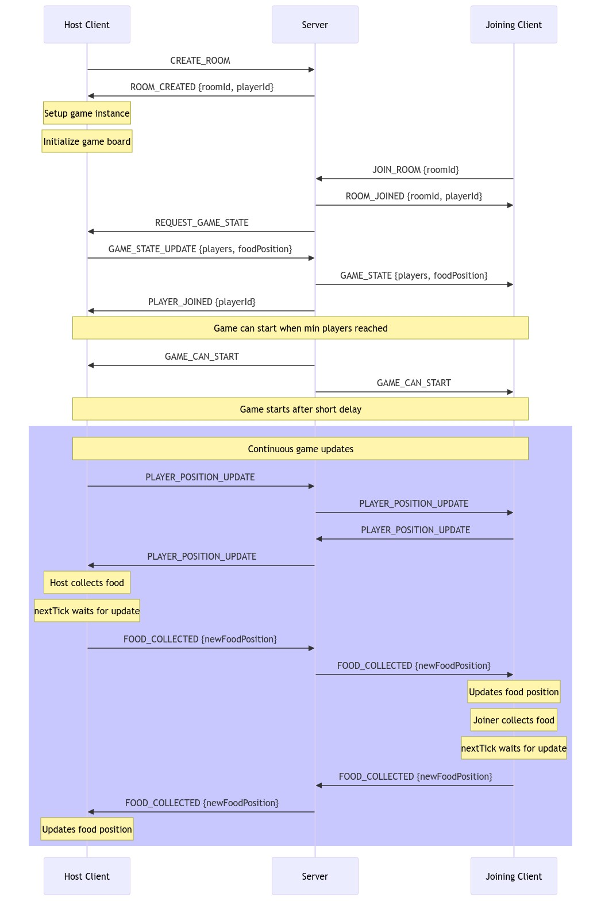

# Snake Game Engine 🐍

A flexible game engine for creating both single player and multiplayer Snake games.

## 🎮 Features

- Single player and multiplayer support
- Customizable rendering system
- Configurable scoring system
- Optional continuous space mode (border crossing)
- Collision system
- Direction queue management

## 📦 Installation

```typescript
npm install snake-game-engine
// or
yarn add snake-game-engine
// or
pnpm add snake-game-engine
```

## 📋 Basic Usage

### Single Player

```typescript
import { Snake } from "./core/snake";

// Game configuration
const gameConfig = {
  width: 20, // Grid width
  height: 20, // Grid height
  tickRate: 200, // Milliseconds between each update
  continuousSpace: false, // If true, snake can cross borders
  scoreConfig: {
    foodMultiplier: 10,
    movementMultiplier: -1,
    useSnakeLength: true,
    onScoreUpdate: (score) => console.log(`Score: ${score}`),
  },
};

// Render configuration
const renderConfig = {
  snakeRenderer: (position) => / logic to render snake /,
  foodRenderer: (position) => / logic to render food /,
  clearRenderer: (element) => / logic to clear an element /,
};

// Create instance
const snake = new Snake(gameConfig, renderConfig, () =>
  console.log("Game Over!")
);

// Start game
snake.start();

// Direction control
snake.setDirection({ x: 1, y: 0 }); // right
snake.setDirection({ x: 0, y: -1 }); // up
snake.setDirection({ x: 0, y: 1 }); // down
snake.setDirection({ x: -1, y: 0 }); // left
```

### Multiplayer

```typescript
import { MultiplayerSnake } from "./core/multiplayer-snake";

// Multiplayer configuration
const multiplayerConfig = {
  onFoodCollected: ({ collectedBy, newFoodPosition }) => {
    // Notify other players when food is collected
  },
  onPlayerPositionUpdate: (playerId, positions) => {
    // Send position updates to other players
  },
  onPlayerDied: (playerId, finalPositions) => {
    // Handle when a player loses
  },
};

// Create multiplayer instance
const multiplayerSnake = new MultiplayerSnake(
  "player-1", // Unique player ID
  gameConfig,
  renderConfig,
  multiplayerConfig,
  () => console.log("Game Over!")
);

// Other players management
multiplayerSnake.addPlayer("player-2", { x: 0, y: 0 });
multiplayerSnake.receivePlayerUpdate("player-2", [/ new positions /]);
multiplayerSnake.updateFoodPosition({ x: 10, y: 10 });
```

## ⚙️ Configuration

### GameConfig

```typescript
interface GameConfig {
  width: number; // Grid width
  height: number; // Grid height
  tickRate: number; // Update speed
  continuousSpace: boolean; // Crossable borders mode
  scoreConfig: {
    foodMultiplier: number; // Points for collected food
    movementMultiplier: number; // Points for movement
    useSnakeLength: boolean; // Use length for score calculation
    calculateScore?: Function; // Custom score calculation function
    onScoreUpdate?: Function; // Score update callback
  };
}
```

### RenderConfig

```typescript
interface RenderConfig<T> {
  snakeRenderer: (position: Vector2D) => T; // Renders snake segment
  foodRenderer: (position: Vector2D) => T; // Renders food
  clearRenderer: (element: T) => void; // Clears element
}
```

## 🔑 Important Notes

- The system is type-safe and uses generics for rendering
- Multiplayer mode requires an external networking system
- The scoring system is fully customizable
- The direction queue prevents too rapid direction changes
- Collisions are handled automatically

## 🔄 Multiplayer Architecture

The following sequence diagram illustrates the message flow in a multiplayer implementation:



## Example Implementations

- [Basic Example](https://github.com/lucabro81/snake-game-engine-examples)
